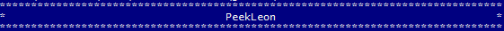

# Description

Permet d'encadrer un text automatiquement  en powershell

# Paramétres

**-text** Texte qui sera affiché dans le cadre

**-caractere** Caractére(s) qui constitue le cadre
>Exemple : "-", "*", "+" ...

**-largeur** Nombre de fois ou le caractére choisi sera répété. Si le texte est trop grand la largeur est automatiquement agrandie.

**-border** Créer un cadre avec une ligne simple ou double. Si utilisé remplace le param *caractere*

**-textalign** Alignement du text : left/center/right

# Exemples


```powershell 
cadre -text "$env:USERNAME" -border simple -textalign center -largeur 80
```



```powershell 
cadre -text "$env:USERNAME" -caractere "*" -textalign center -largeur 80
```


```powershell 
cadre -text "$env:USERNAME `n $(get-date)"  -border double -textalign "center" -largeur 80
```


```powershell 
Write-Host -ForegroundColor Yellow $(cadre -text "$env:USERNAME" -border simple -textalign center -largeur 80)
``` 


```powershell 
Write-Host -BackgroundColor black  -ForegroundColor Yellow $(cadre -text "PeekLeon" -caractere " " -textalign center -largeur 80)
``` 
